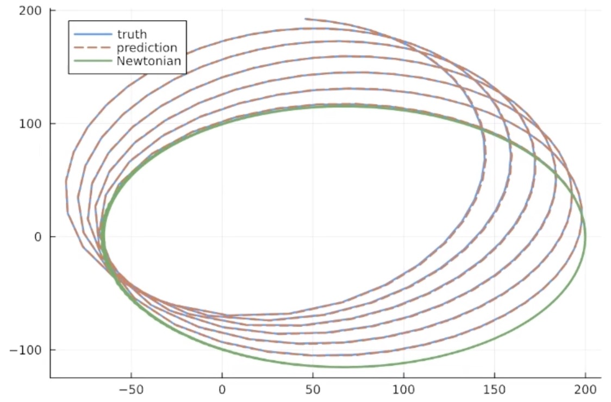
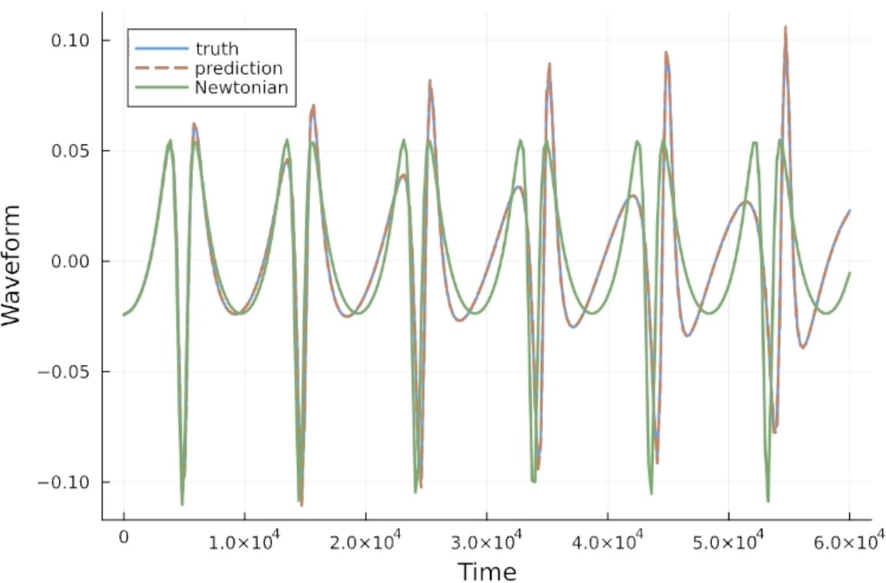
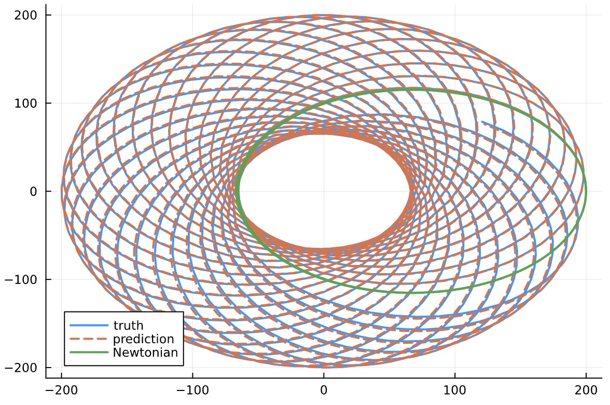

# Black Hole Dynamics Modeling

This project addresses the complex challenge of simulating orbital dynamics around black holes using physics-informed machine learning. At its core, the work combines traditional orbital mechanics with neural networks to enhance simulation accuracy while maintaining physical plausibility.

We model the dynamics of particles orbiting black holes, and for that we've used three different models, namely a Newtonian model, a relativistic model (incorporating general relativity effects), and a neural network model. The neural network learns to correct the simpler Newtonian model to approximate the more complex relativistic behavior, essentially learning the physics that the Newtonian model misses. 

For example, when we try to plot(figure above) the orbital trajectories of a particle around  the black hole using these three different models (Newtonian[Green], relativistic[Blue], neural network[Red]), we can observe that the neural network is able to learn the underlying the phenomena with the underlying relativistic mechanism exaclty, while the newtonian misses much information and fail capture the relativistic mechanism over space.

Similarly, considering the gravitational waveforms generated by these three models over time, this plot(figure above) demonstrates that the neural network has successfully learned to correct the Newtonian model to accurately predict gravitational wave patterns that match those produced by general relativity.

And now when it comes to forcasting the extended orbital trajectories for a particle around the black hole over a much longer timeframe with these models, it demonstrates the orbital precession, where relativistic effects cause an orbit's orientation to gradually rotate, creating complex rosette patterns, while the Newtonian model simply traces the same elliptical path repeatedly. The neural network prediction closely matches the relativistic truth model even over this extended timeframe, validating its ability to generalize beyond its training data and accurately capture complex relativistic behaviors. The dense mesh pattern illustrates a fundamental characteristic of general relativity that orbits near strong gravitational fields never exactly repeat their paths showing how effectively the neural network has learned to replicate this sophisticated physical phenomenon.

#### Documentation in-progress
